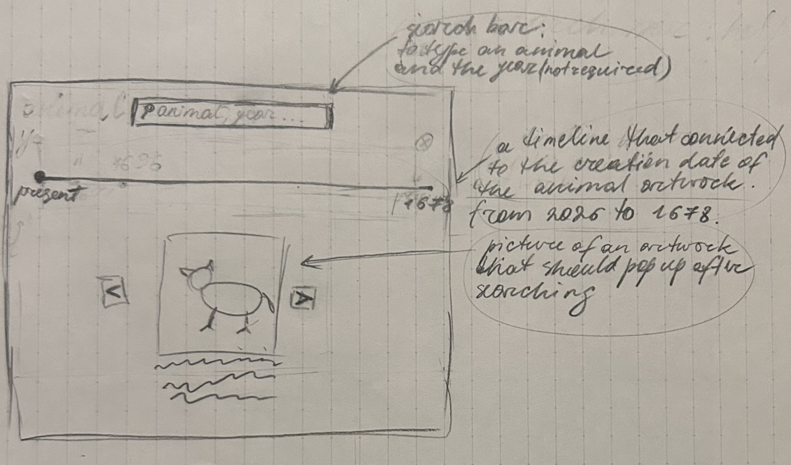
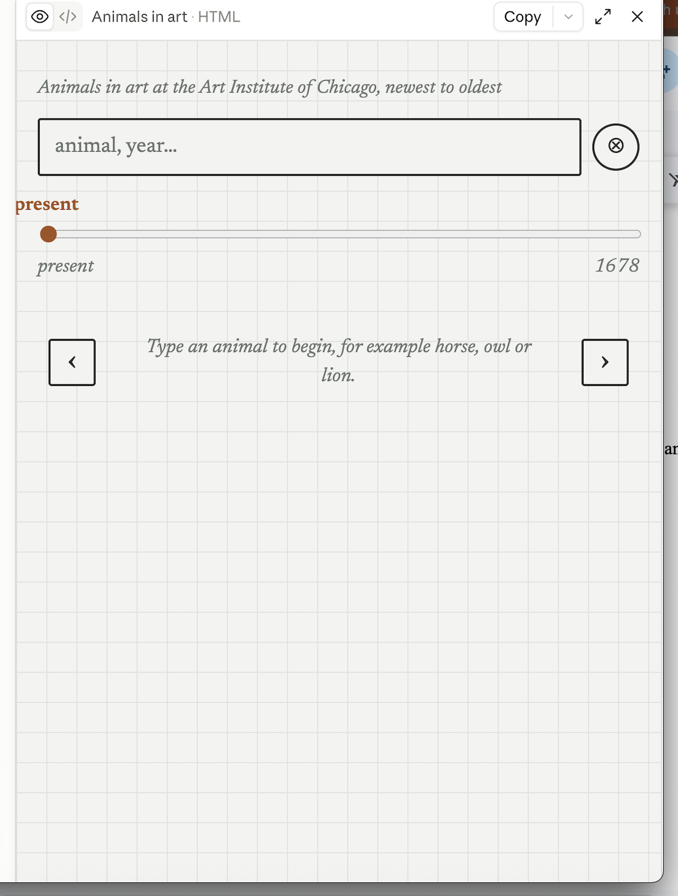

# Day 1 "before" snapshot

Write your own, even if you worked in a pair. Keep it: we come back to it at mid-quarter (Week 6) and at the end (Week 11). Your prompts go in `ai_log.md`, not here.

**Name:**
**Partner (if any):**

## Before we prompted

### 1. Who is it for, and what do they want to do?

It's for ___ who want to ___.

**"The user can..." sentences:**
1.
2.

### 2. Our sketch

Put the photo in this `hw0` folder, then change the filename below to match:

### 3. Our prediction

We expected the app would...

## What we got

### 4. What the AI made

Put the screenshot in this `hw0` folder, then change the filename below to match:

### 5. Sketch vs. app

- **Matches our sketch:**
- **Different from our sketch:**
- **The AI decided** (something we never said):

### 6. What did I keep, change, or reject, and why?

### 7. Explain back

Pick one part of the code. In your own words, what does it do?

## Looking ahead

### 8. What does it do? Does it work? What broke?

### 9. How much do I understand about how it works? (0–100%)

**My number:**

**Why that number:**

### 10. What would I need to know to tell whether it's *well designed or well built*?

### 11. What do I hope to be able to do by week 10?

